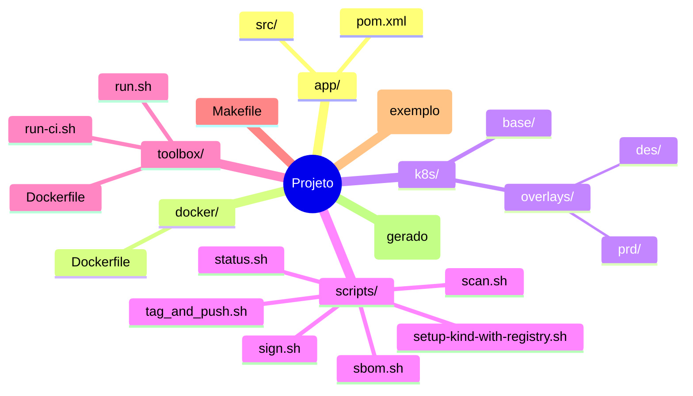
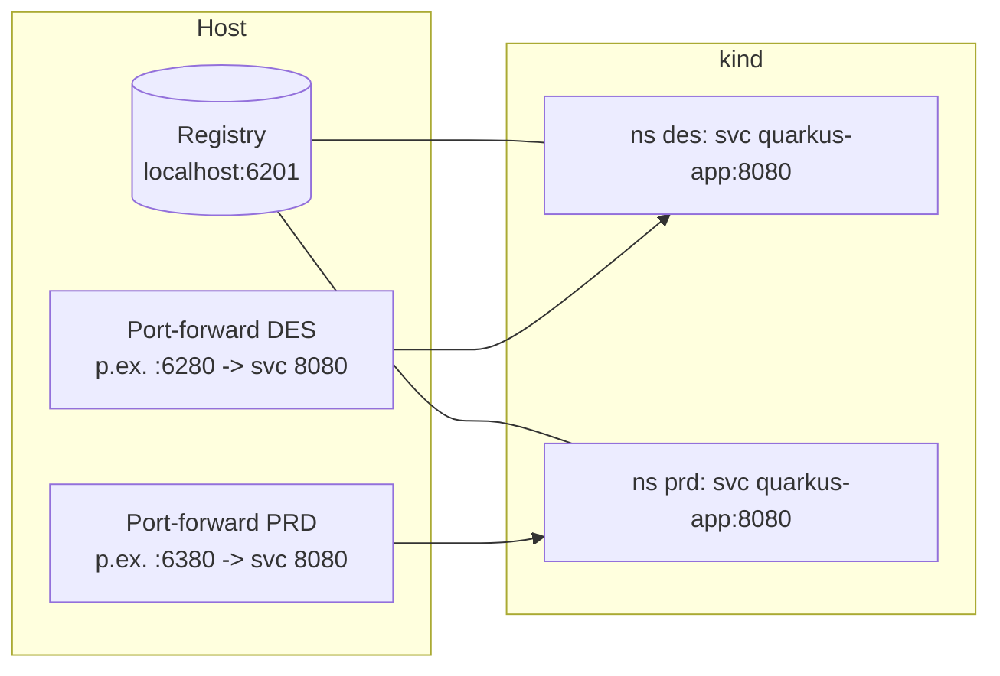

# 🚀 Hackathon CAIXA 2025 – DevSecOps Demo

**Pipeline completa de DevSecOps** para aplicações **Quarkus** com **Kubernetes local (kind)**

> 🎯 **Objetivo**: Demonstrar um fluxo completo de build, segurança e deploy com ferramentas modernas de DevSecOps

## 📋 O que este projeto faz

✅ **Build** → Compila aplicação Quarkus (Java 17 + Maven)  
✅ **Segurança** → Scan de vulnerabilidades (Trivy) + SBOM (Syft) + Assinatura (Cosign)  
✅ **Deploy** → Kubernetes local com dois ambientes (DES/PRD)  
✅ **Monitoramento** → Status e health checks automatizados  

## 🚀 Início Rápido (3 comandos)

```bash
# 1. Pipeline completa de desenvolvimento
make pipeline-jquarkus-qs-backend-des

# 2. Ver status da aplicação
make status

# 3. Testar a aplicação (nova aba do terminal)
kubectl -n des port-forward svc/quarkus-app 8080:8080 &
curl http://localhost:8080/hello
```

## 📊 Comandos Principais

| Comando | O que faz | Quando usar |
|---------|-----------|-------------|
| `make pipeline-jquarkus-qs-backend-des` | 🔧 Pipeline completa DES (infra + build + scan + deploy) | **Primeiro uso** ou desenvolvimento |
| `make pipeline-jquarkus-qs-backend-prd` | 🚀 Pipeline PRD com scan rigoroso | **Produção** (após DES funcionar) |
| `make status` | 📊 Status dos pods, deploys e health checks | **Verificar** se tudo está funcionando |
| `make clean` | 🧹 Limpar artefatos locais | **Limpeza** rápida |
| `make env-down` | 🗑️ Remover cluster e registry | **Reset** completo |

## ⚙️ Configuração de Portas

> **Para evitar conflitos**, este projeto usa **range 6200–6500**:
>
> - **Registry local:** `localhost:6201`
> - **Port-forward DES:** porta alocada automaticamente (ex.: `http://localhost:6280`)
> - **Port-forward PRD:** porta alocada automaticamente (ex.: `http://localhost:6380`)
>
> 💡 Ajuste exportando `REGISTRY_PORT=62XX` se necessário.

---

## 🛠️ Como obter o projeto

### Opção A — Clonar o repositório completo
```bash
git clone https://github.com/thiagodasilvamenezes/hackathon-caixa-devsecops.git
cd hackathon-caixa-devsecops
```

### Opção B — Já tenho o projeto em disco
Apenas entre no diretório do projeto (onde está este README) e siga os passos abaixo.

### Opção C — Usar imagem pronta do GitHub Container Registry
Se preferir não clonar, use diretamente nossa imagem:
```bash
docker pull ghcr.io/thiagodasilvamenezes/caixa-devsecops-hackathon/runner:latest
# Veja seção "Executar usando imagem GHCR" abaixo
```

---

## 💻 Requisitos por Sistema

### 🐧 Linux / macOS
- 🐳 **Docker** instalado e rodando
- 💾 **4GB RAM livres** (recomendado 8GB)
- 🔧 **GNU Make** (opcional - pode usar scripts diretos)

### 🪟 Windows
- 🐳 **Docker Desktop** com WSL2 habilitado
- 💾 **8GB RAM livres** (recomendado 16GB)
- 🔧 **PowerShell** ou **WSL2** (Ubuntu recomendado)

**Como instalar no Windows:**
1. Instale **Docker Desktop** → Settings → Use WSL2 engine ✅
2. Instale **WSL2 Ubuntu** da Microsoft Store
3. No PowerShell: `wsl --install -d Ubuntu` (se não fez pelo Store)

### ☁️ Cloud / CI/CD
- 🚀 **GitHub Actions** com runner self-hosted
- 🌐 **Qualquer VM** com Docker (2 vCPU + 4GB mínimo)

**Sistemas testados:**
- ✅ **WSL2** (Windows 10/11)
- ✅ **Ubuntu/Debian/CentOS** 
- ✅ **macOS** (Intel/Apple Silicon)
- ✅ **Docker Desktop** (Windows/Mac)

---
- Portas livres: **6201** (registry) e **algumas no range 6200–6500** para port-forward.
## 🎬 Tutorial Passo a Passo

### 🪟 Windows (Docker Desktop)

> 📖 **Guia completo Windows**: [`doc/WINDOWS-DOCKER-DESKTOP-GUIDE.md`](doc/WINDOWS-DOCKER-DESKTOP-GUIDE.md) - Instalação detalhada, troubleshooting específico

**Primeira vez no Windows:**
```powershell
# 1. Clone o projeto
git clone https://github.com/thiagodasilvamenezes/hackathon-caixa-devsecops.git
cd hackathon-caixa-devsecops

# 2. Execute a pipeline (usa Docker Desktop)
docker run --rm -it `
  -v /var/run/docker.sock:/var/run/docker.sock `
  -v "${PWD}:/work" `
  -v "$env:USERPROFILE\.kube:/root/.kube" `
  -v "$env:USERPROFILE\.docker:/root/.docker" `
  --add-host=host.docker.internal:host-gateway `
  --workdir /work `
  caixa-devsecops/toolbox:latest `
  bash -lc "make pipeline-jquarkus-qs-backend-des && make status"

# 3. Testar aplicação (nova janela PowerShell)
kubectl -n des port-forward svc/quarkus-app 8080:8080
# Acesse: http://localhost:8080/hello
```

### 🐧 Linux / WSL / macOS

**Primeira vez Unix-like:**
```bash
# 1. Clone o projeto
git clone https://github.com/thiagodasilvamenezes/hackathon-caixa-devsecops.git
cd hackathon-caixa-devsecops

# 2. Execute a pipeline
make pipeline-jquarkus-qs-backend-des

# 3. Ver status
make status

# 4. Testar aplicação (nova aba do terminal)
kubectl -n des port-forward svc/quarkus-app 8080:8080 &
curl http://localhost:8080/hello
curl http://localhost:8080/q/health
```

### 🔄 Fluxo Completo (todos os sistemas)

**O que acontece em cada comando:**

1️⃣ **Pipeline DES** (`make pipeline-jquarkus-qs-backend-des`)
- 🏗️ Cria cluster Kubernetes local (kind)
- 📦 Sobe registry local (porta 6201)
- 🔨 Compila aplicação Quarkus (Java 17 + Maven)
- 🛡️ Executa scan de segurança (Trivy)
- 📋 Gera SBOM (inventário de componentes)
- ✍️ Assina imagem com Cosign
- 🚀 Deploy no ambiente DES

2️⃣ **Verificar status** (`make status`)
- Saída esperada: `✅ Pipeline DES: OK`, `🎯 Cluster: 1 nó ativo`, `📦 Pods DES: running`, `🌐 Health: UP`

3️⃣ **Promover para PRD** (`make pipeline-jquarkus-qs-backend-prd`)
- 🔄 Promove imagem DES → PRD
- 🛡️ Scan **rigoroso** (falha em vulnerabilidades)
- 🚀 Deploy no ambiente PRD isolado

4️⃣ **Limpeza** (`make clean` ou `make env-down`)

---

## ⚙️ Configuração Avançada

Você pode customizar o comportamento com variáveis de ambiente:

```bash
# Porta do registry local (evita conflitos)
export REGISTRY_PORT=6205

# Tag para produção
export PRD_TAG=v2.0.0

# Scan rigoroso (falha em vulnerabilidades)
export STRICT=true

# Senha para assinatura digital
export COSIGN_PASSWORD='minha-senha-segura'

# Executar com configurações personalizadas
make pipeline-jquarkus-qs-backend-des
```

### Execução com **app-fetch** (usar código oficial Quarkus Quickstart)
Quando quiser sincronizar o `app/` com o upstream (em vez de usar o código local), rode:
```bash
FETCH=1 APP_REF=v3.9.2 make pipeline-jquarkus-qs-backend-des
```
Sem `FETCH=1`, o fluxo usa o conteúdo do diretório `app/` do próprio projeto.

---

## 🐳 Executar usando imagem pronta (GHCR)

**Alternativa rápida**: Use nossa imagem pré-construída sem precisar clonar o repositório.

```bash
# Puxar a imagem
docker pull ghcr.io/thiagodasilvamenezes/caixa-devsecops-hackathon/runner:latest

# Executar pipeline DES
docker run --rm -it \
  -v $HOME/.kube:/root/.kube:ro \
  -v /var/run/docker.sock:/var/run/docker.sock \
  -v $(pwd):/workspace:rw \
  ghcr.io/thiagodasilvamenezes/caixa-devsecops-hackathon/runner:latest \
  /workspace/run.sh pipeline-dev

# Ver status
docker run --rm -it \
  -v $HOME/.kube:/root/.kube:ro \
  -v /var/run/docker.sock:/var/run/docker.sock \
  ghcr.io/thiagodasilvamenezes/caixa-devsecops-hackathon/runner:latest \
  /workspace/run.sh status
```

> 📖 **Instruções completas** em [`USO-GHCR.md`](USO-GHCR.md) (inclui PowerShell, Release/tar.gz, troubleshooting)

---

## 📊 Variáveis de Configuração

| Variável | Padrão | Descrição |
|----------|---------|-----------|
| `REGISTRY_PORT` | `6201` | 🔌 Porta do registry local |
| `PRD_TAG` | `v1.0.0` | 🏷️ Tag para ambiente de produção |
| `STRICT` | `true` | 🛡️ Falhar em vulnerabilidades altas |
| `COSIGN_PASSWORD` | *(vazio)* | 🔐 Senha para assinatura digital |

**Exemplos de uso:**
```bash
# Registry em porta diferente
REGISTRY_PORT=6205 make pipeline-jquarkus-qs-backend-des

# Scan permissivo (não falha em CVEs)
STRICT=false make pipeline-jquarkus-qs-backend-des

# Tag personalizada para PRD
PRD_TAG=v2.1.0 make pipeline-jquarkus-qs-backend-prd
```

---

## 🔐 Assinatura Digital (Cosign)
A primeira execução gera `cosign.key`/`cosign.pub`. Para assinatura automática:

```bash
export COSIGN_PASSWORD='minha-senha-segura'
make pipeline-jquarkus-qs-backend-des
```

**Onde definir a senha:**
- 🔧 **Variável de ambiente:** `export COSIGN_PASSWORD='...'`
- 📄 **Arquivo .env:** `COSIGN_PASSWORD=minha-senha`
- 🚀 **CI/CD:** Configure como secret

> 💡 **Produção:** Use digest em vez de tags e considere KMS/HSM

---

## 📈 Comando Status

O comando `make status` fornece visão completa:

```bash
make status
```

**Exemplo de saída:**
```
✅ Pipeline DES: OK (pipeline-des.ok)
🚫 Pipeline PRD: FAIL (pipeline-prd.fail)
🎯 Cluster: caixa-devsecops (1 node ready)
📦 DES pods: quarkus-app-xxx running
📦 PRD pods: (none)
🌐 Health DES: UP (port 6280)
🌐 Health PRD: DOWN
📁 Images: localhost:6201/quarkus-getting-started:dev-abc123
```

> Se `kubectl` não estiver no host, usa automaticamente a toolbox

---

## 🧹 Limpeza e Manutenção

| Comando | O que remove | Quando usar |
|---------|--------------|-------------|
| `make clean` | 🗑️ Artefatos locais, containers temporários | Limpeza rápida |
| `make clean-app` | 🔨 Build Maven (target/) | Problemas de build |
| `make clean-docker-images` | 🐳 Imagens do projeto | Liberar espaço |
| `make clean-sbom` | 📋 SBOMs grandes (arquiva) | SBOMs acumulando |
| `make env-down` | 🏗️ Cluster + registry | Reset completo |
| `make deep-clean` | 💥 Tudo + volumes Docker | Limpeza total |

**Exemplo de uso:**
```bash
# Limpeza segura (mantém cluster)
make clean

# Reset completo para recomeçar
make env-down && make pipeline-jquarkus-qs-backend-des
```

---

## 🚀 GitHub Actions (CI/CD Automático)

**Para times que querem automação completa** sem executar comandos manuais.

### 🎯 Quando usar GitHub Actions
- ✅ **Time colaborativo** → Vários desenvolvedores
- ✅ **CI/CD completo** → Automação push → deploy
- ✅ **Ambientes remotos** → Executar em VMs/Cloud
- ✅ **Artefatos organizados** → Downloads, relatórios, SBOMs

### ⚡ Setup super rápido (5 min)

1. **Configure runner** (uma vez só):
   ```bash
   # Linux/WSL/macOS
   docker run -d --restart=always --name gh-runner-devsecops \
     -e REPO_URL="https://github.com/thiagodasilvamenezes/hackathon-caixa-devsecops.git" \
     -e RUNNER_TOKEN="SEU_TOKEN_DO_GITHUB" \
     -v /var/run/docker.sock:/var/run/docker.sock \
     -v $HOME/.kube:/root/.kube \
     ghcr.io/thiagodasilvamenezes/caixa-devsecops-hackathon/runner:latest
   ```

   > 📝 **Nota sobre RUNNER_TOKEN**: 
   > - **Para testes**: Substitua `SEU_TOKEN_DO_GITHUB` pelo token em [`doc/.github/tokenGithub.txt`](doc/.github/tokenGithub.txt)
   > - **Como obter**: GitHub → Settings → Actions → Runners → New self-hosted runner
   > - **⚠️ Importante**: Tokens são sensíveis - não os commite em repositórios públicos

2. **Configure secrets** em Settings → Secrets:
   - `COSIGN_PASSWORD` → `hackathon2025` (ou sua senha)

3. **Execute workflows** na aba Actions:
   - **DEV Pipeline** → Desenvolvimento
   - **Promote to PRD** → Produção

> 📖 **Guia completo:** [`doc/README-passos-para-usuarios-github-actions.md`](doc/README-passos-para-usuarios-github-actions.md)

---

## 🏗️ Arquitetura do Projeto

```
📁 hackathon-caixa-devsecops/
├── 🚀 run.sh                    # Launcher principal
├── 📋 Makefile                  # Automação (pipelines, limpeza)
├── 📱 app/                      # Aplicação Quarkus
├── 🐳 docker/Dockerfile         # Build da aplicação
├── 🔧 toolbox/                  # Imagem com ferramentas DevSecOps
├── ☸️  k8s/                     # Manifests Kubernetes
│   ├── base/                    # Base Kustomize
│   └── overlays/des,prd/        # Ambientes específicos
├── 📜 scripts/                  # Scripts auxiliares
├── 📊 sbom/                     # SBOMs gerados
└── 📖 doc/                      # Documentação
```

**Fluxo da Pipeline:**
```
🔨 Build → 🛡️ Scan → 📋 SBOM → ✍️ Sign → 🚀 Deploy
```

---

## ❓ Troubleshooting

### Problemas Comuns

**🔴 Pod fica em Pending**
```bash
# Verificar recursos
kubectl -n des describe pod quarkus-app-xxx
# Solução: escalar para 0 e voltar a 1
kubectl -n des scale deployment quarkus-app --replicas=0
kubectl -n des scale deployment quarkus-app --replicas=1
```

**🔴 Erro de porta 6201 ocupada**
```bash
# Usar porta diferente
REGISTRY_PORT=6205 make pipeline-jquarkus-qs-backend-des
```

**🔴 Trivy falha com CVEs**
```bash
# Scan permissivo
STRICT=false make pipeline-jquarkus-qs-backend-des
```

**🔴 Cluster com problemas de TLS**
```bash
# Reset completo
make env-down
make pipeline-jquarkus-qs-backend-des
```

### Logs Úteis
```bash
# Status detalhado
make status

# Logs da aplicação
kubectl -n des logs deployment/quarkus-app

# Eventos do cluster
kubectl get events --all-namespaces --sort-by='.lastTimestamp'
```

---

## 🎯 Próximos Passos Sugeridos

- [ ] 🔒 **Digest-based signing** (mais seguro que tags)
- [ ] 📊 **Watch status** (atualização contínua)
- [ ] 🛡️ **SLSA provenance** (cadeia de build)
- [ ] 🔍 **SAST integration** (análise estática)
- [ ] 🌐 **Ingress/NodePort** (acesso externo)

---

## 📚 Arquivos Importantes

| 📁 Arquivo/Pasta | 📝 Descrição | 🎯 Para quem |
|----------------|-------------|-------------|
| 📋 [`doc/README-passos-para-usuarios-github-actions.md`](doc/README-passos-para-usuarios-github-actions.md) | **Guia completo GitHub Actions** - Setup, troubleshooting, Windows PowerShell | 🤖 Times CI/CD |
| 🪟 [`doc/WINDOWS-DOCKER-DESKTOP-GUIDE.md`](doc/WINDOWS-DOCKER-DESKTOP-GUIDE.md) | **Guia Windows detalhado** - Docker Desktop, troubleshooting específico | 🪟 Usuários Windows |
| 📖 [`USO-GHCR.md`](USO-GHCR.md) | **Usar imagem pronta** - Docker pull, Windows PowerShell, sem clone | ⚡ Setup rápido |
| 🔧 [`hack-solution/`](hack-solution/) | **Solução do hackathon** - Código-fonte Quarkus completo | 🧑‍💻 Desenvolvedores |
| 🏗️ [`k8s-manifests/`](k8s-manifests/) | **Kubernetes Manifests** - Deployments, Services, Kustomize | ☸️ DevOps |
| ⚙️ [`jenkins-pipeline/`](jenkins-pipeline/) | **Pipeline Jenkins** - Alternativa ao GitHub Actions | 🏭 Enterprise |

---

## 🎯 Próximos Passos

### 🆕 **Para Usuários Iniciantes**
1. ✅ Execute o **Tutorial Básico** Windows ou Linux (seção acima)
2. 🎮 Teste **Health Check**: `http://localhost:6280/q/health`
3. 📊 Veja **artefatos gerados**: pasta `sbom/`, relatórios Trivy
4. 📖 Leia sobre [DevSecOps na prática](https://about.gitlab.com/topics/devsecops/)

### 🚀 **Para Times Avançados**
1. 🤖 Configure **GitHub Actions** → Automação completa
2. 🔧 Customize **policies Trivy** → Edite `trivy-config.yaml`
3. 🏭 Integre com **registries corporativos** → Harbor, ECR, ACR
4. 🛡️ Adicione **SAST/DAST** → SonarQube, OWASP ZAP

---

## 🆘 Troubleshooting Rápido

| ❌ **Problema** | 🔧 **Solução Windows** | � **Solução Linux/WSL** |
|----------------|----------------------|-------------------------|
| **"kind not found"** | `choco install kind` | `curl -Lo ./kind https://kind.sigs.k8s.io/dl/v0.20.0/kind-linux-amd64 && chmod +x ./kind && sudo mv ./kind /usr/local/bin/kind` |
| **"Docker daemon"** | Inicie **Docker Desktop** | `sudo systemctl start docker` |
| **"Permission denied kubectl"** | Execute **PowerShell como Admin** | `sudo chown $(id -u):$(id -g) $HOME/.kube/config` |
| **"Port 6201 occupied"** | `$env:REGISTRY_PORT="6205"; make pipeline-jquarkus-qs-backend-des` | `REGISTRY_PORT=6205 make pipeline-jquarkus-qs-backend-des` |
| **Pod fica Pending** | `kubectl -n des scale deployment quarkus-app --replicas=0` depois `--replicas=1` | Mesmo comando |

### 🔍 **Comandos de Diagnóstico**
```bash
# Windows PowerShell
docker info                          # ✅ Docker funcionando?
kind get clusters                     # ✅ Cluster exists?
kubectl get pods -A                   # ✅ Pods rodando?

# Linux/WSL/macOS  
docker info                          # ✅ Docker funcionando?
kind get clusters                     # ✅ Cluster exists?
kubectl get pods -A                   # ✅ Pods rodando?
```

---

## � Hackathon Caixa 2025 - DevSecOps Challenge

> 🎯 **Missão**: Demonstrar pipeline **DevSecOps production-ready** com segurança integrada desde o primeiro commit.

### 💫 **O que este projeto entrega:**
- 🔒 **Security by Design** → Trivy, Cosign, SBOM automático
- 📦 **SBOM Generation** → Rastreabilidade completa de dependências  
- ✍️ **Image Signing** → Cosign para garantir integridade
- ☸️ **Kubernetes Native** → Deploy via kind (simula produção)
- 🤖 **CI/CD Ready** → GitHub Actions + self-hosted runners
- 🌍 **Multi-Platform** → Windows, Linux, macOS, WSL2

### 🎨 **Tecnologias Integradas:**
```
🚀 Quarkus + ☕ Java 17 + 📦 Maven 
    ↓
🛡️ Trivy Scanning + 📋 Syft SBOM + ✍️ Cosign Signing
    ↓  
🐳 Docker + ☸️ Kubernetes (kind) + 🎯 Kustomize
    ↓
🤖 GitHub Actions + 📊 Artifacts + 🔍 Observability
```

> 💡 **Diferencial**: Este é um **toolkit production-ready** que pode ser adaptado para projetos corporativos reais, não apenas um demo de hackathon.

---

**🎉 Feito com ❤️ para o Hackathon Caixa 2025 | DevSecOps Excellence**

---

*📌 Última atualização: Janeiro 2025 | Versão: 2.0 Enhanced*    T -->|build Java/Maven| B[Imagem Temurin 17<br/>Quarkus app]
    B -->|push :dev-dev| R
    R -->|pull| K
    T -->|Trivy (scan)\nSyft (SBOM)\nCosign (sign)| SEC[Artefatos: sbom/, assinaturas]

    click R "http://localhost:6201/v2/_catalog" "Registry local"
```

### 2) Layout do repositório


### 3) Alvos principais (Make)
```mermaid
flowchart LR
    A[toolbox-build] --> B[toolbox-shell]
    A --> C[pipeline-jquarkus-qs-backend-des]
    C --> D[build app + image]
    D --> E[scan (Trivy) + SBOM (Syft)]
    E --> F[sign (Cosign)]
    F --> G[deploy DES (kustomize)]
    C --> H[status]

    I[pipeline-jquarkus-qs-backend-prd] --> J[promote tag -> PRD_TAG]
    J --> K[scan STRICT + sign]
    K --> L[deploy PRD]
    L --> H
```

### 4) Portas e acesso


---

## Troubleshooting rápido
| Sintoma | Causa provável | Ação |
|---------|----------------|------|
| Pod `Pending` extra | Réplica antiga com tag mutável / image pull atrasado | `kubectl -n <ns> describe pod ...`; se sobrar, escalar p/ 0 e voltar p/ 1, ou recriar cluster |
| TLS x509 0.0.0.0 vs 127.0.0.1 | Cluster antigo com SAN 0.0.0.0 | `make env-down` e recriar; toolbox já corrige kubeconfig internamente |
| Cosign pede senha | `COSIGN_PASSWORD` não exportado ou chave antiga cifrada | `export COSIGN_PASSWORD=...` e repetir assinatura/pipeline |
| `kubectl` ausente | Ambiente WSL limpo | `make status` (fallback) ou `make toolbox-shell` |
| Porta 6201 ocupada | Conflito local | `REGISTRY_PORT=62xx make pipeline-jquarkus-qs-backend-des` |

---

## Créditos e referências
- **Repo (scripts/código):** https://github.com/thiagodasilvamenezes/hackathon-caixa-devsecops.git
- **Imagem do runner (GHCR):** `ghcr.io/thiagodasilvamenezes/caixa-devsecops-hackathon/runner:latest`
- Base Quarkus: *Getting Started* (Temurin 17)
