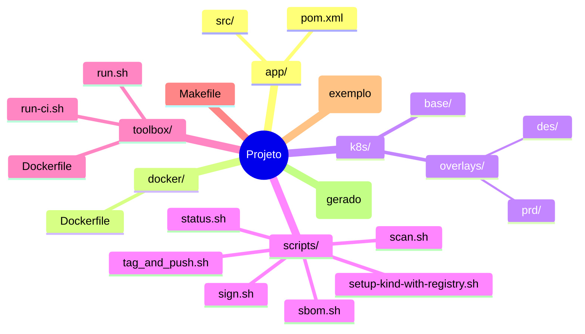
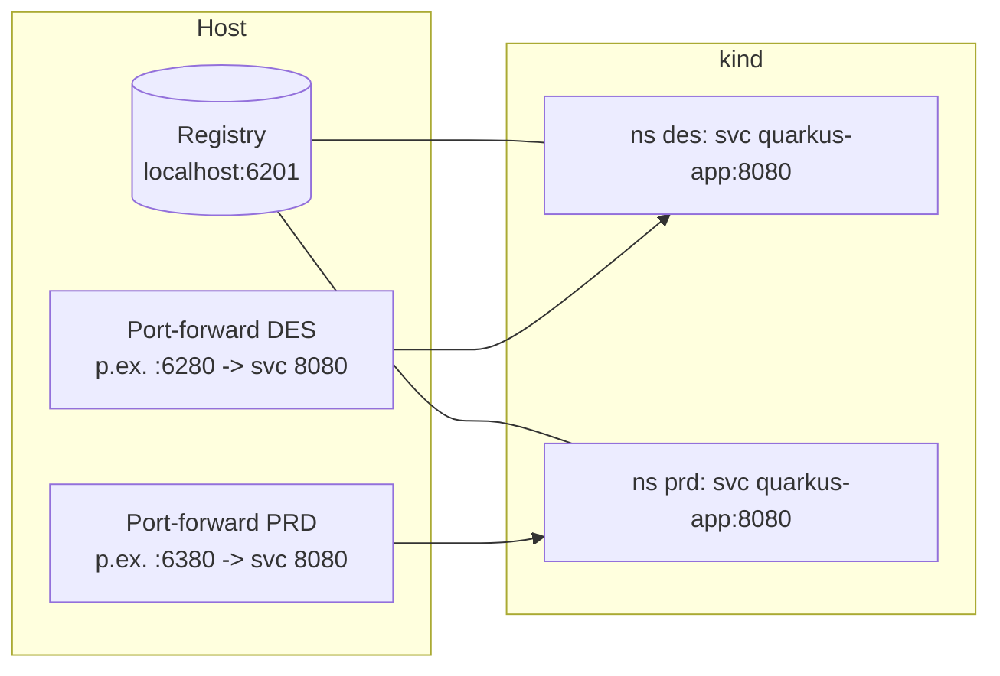

# Hackathon CAIXA 2025 – DevSecOps (Toolbox + kind)

Pipeline local para build, segurança e deploy de um app **Quarkus** (Temurin 17) em **Kubernetes (kind)** com dois ambientes: **DES** (desenvolvimento) e **PRD** (promoção). Ferramentas: **Trivy** (vulnerabilidades), **Syft** (SBOM), **Cosign** (assinatura). Status simplificado via `make status` (sem precisar de comandos kubectl no host).

> **Importante sobre portas (atualizado):** para evitar conflitos, todo o projeto usa **range 6200–6500**. Os padrões são:
>
> - **Registry local:** `localhost:6201`
> - **Port-forward DES (HTTP):** porta alocada no intervalo (ex.: `http://localhost:6280`)
> - **Port-forward PRD (HTTP):** porta alocada no intervalo (ex.: `http://localhost:6380`)
>
> Você pode ajustar exportando `REGISTRY_PORT` e/ou mudando o arquivo de configuração/Makefile.

---

## Como obter o projeto

### Opção A — Você só tem este README (clonar o repositório)
Baixe todo o projeto com os scripts e Makefiles em:
```bash
git clone https://github.com/thiagodasilvamenezes/hackathon-caixa-devsecops.git
cd hackathon-caixa-devsecops
```

### Opção B — Já tem o projeto em disco
Apenas entre no diretório do projeto (onde está este README) e siga os passos abaixo.

---

## Visão rápida dos principais alvos
| Alvo | Descrição |
|------|-----------|
| `toolbox-build` | Build da imagem de ferramentas (kubectl, kind, trivy, syft, cosign) |
| `toolbox-shell` | Shell interativo dentro da toolbox |
| `pipeline-jquarkus-qs-backend-des` | Pipeline one-shot (infra + build + scan não bloqueante + SBOM + assinatura + deploy DES) |
| `pipeline-jquarkus-qs-backend-prd` | Pipeline PRD (build + scan STRICT + SBOM + assinatura + deploy PRD) |
| `jquarkus-qs-backend-des` | Fluxo manual (mesmas etapas da pipeline DEV) |
| `jquarkus-qs-backend-prd` | Promoção manual para PRD (retag + scan STRICT + SBOM + assinatura + deploy) |
| `status` | Resumo de pipelines, nós, deployments, pods e health |
| `env-down` | Remove cluster kind + registry |

---

## Requisitos no host (WSL ou Linux)
- **Docker** funcional. (O KIND roda dentro da toolbox e usa o engine do host.)
- **GNU make** (opcional; sem ele você pode rodar scripts manualmente).
- Portas livres: **6201** (registry) e **algumas no range 6200–6500** para port-forward.
- (Opcional) `COSIGN_PASSWORD` (senha para assinatura).

> Em WSL, a toolbox já aplica correções de `kubeconfig` (usa `host.docker.internal`/gateway para falar com o API server do kind).

---

## Passo a passo padrão (execução local, sem GitHub Actions)

```bash
# 0) (Opcional) Ajustar variáveis
export REGISTRY_PORT=6201           # porta do registry local
export PRD_TAG=v1.0.0               # tag de produção
export STRICT=true                  # falhar em CVEs altos/crit
export COSIGN_PASSWORD='minha-senha-segura'  # se quiser assinar de forma não interativa

# 1) Executar pipeline DEV completa (cria cluster + registry + build + scan + SBOM + assinatura + deploy DES)
make pipeline-jquarkus-qs-backend-des

# 2) Ver status (usa toolbox automaticamente se kubectl não estiver no host)
make status

# 3) Testar aplicação DES (exemplo usando port-forward)
#    A pipeline reserva automaticamente portas no range 6200–6500 e escreve em _artifacts/ports.*
#    Para testar manualmente:
kubectl -n des port-forward svc/quarkus-app 8080:8080 &
curl -s http://localhost:8080/hello
curl -s http://localhost:8080/q/health

# 4) Promover para PRD com scan STRICT
make pipeline-jquarkus-qs-backend-prd STRICT=true
make status

# 5) Limpeza total
make env-down
```

### Execução com **app-fetch** (usar código oficial Quarkus Quickstart)
Quando quiser sincronizar o `app/` com o upstream (em vez de usar o código local), rode:
```bash
FETCH=1 APP_REF=v3.9.2 make pipeline-jquarkus-qs-backend-des
```
Sem `FETCH=1`, o fluxo usa o conteúdo do diretório `app/` do próprio projeto.

---

## Variáveis principais (Makefile / ambiente)
| Variável | Default | Uso |
|----------|---------|-----|
| `REGISTRY_PORT` | **6201** | Porta do registry local (range reservado **6200–6500**) |
| `REGISTRY` | `localhost:$(REGISTRY_PORT)` | Endpoint base do registry |
| `APP_NAME` | `quarkus-getting-started` | Nome lógico da imagem local |
| `PRD_TAG` | `v1.0.0` | Tag estável promovida |
| `STRICT` | `true` | Gating de severidade alta/crit (Trivy) |
| `COSIGN_PASSWORD` | (vazio) | Senha da chave cosign (se definido) |

Exemplos:
```bash
# alterando registry para 6205 e relaxando Trivy
REGISTRY_PORT=6205 STRICT=false make pipeline-jquarkus-qs-backend-des

# promover com outra tag
PRD_TAG=v2.1.0 make pipeline-jquarkus-qs-backend-prd
```

---

## Cosign (assinatura de imagem)
A primeira execução gera `cosign.key`/`cosign.pub`. Para evitar prompt de senha e assinar automaticamente:
```bash
export COSIGN_PASSWORD='minha-senha-segura'
make pipeline-jquarkus-qs-backend-des
```
> Em produção, prefira assinar **por digest** e usar um **KMS**.

---

## Status simplificado
`make status` mostra:
- Resultado das últimas pipelines (`pipeline-des.ok|fail`, `pipeline-prd.ok|fail`).
- Nós do cluster kind.
- Deployments e pods nos namespaces `des` e `prd`.
- Health (`/q/health`) via port-forward efêmero.
- Imagens publicadas no registry local.

Se `kubectl` não existir no host, o comando relança automaticamente dentro da toolbox.

---

## Execução via GitHub Actions (opcional)

Você pode rodar tudo via **GitHub Actions** com um runner **self-hosted** (em container).

- **Imagem do runner:** `ghcr.io/thiagodasilvamenezes/caixa-devsecops-hackathon/runner:latest`
- **Repo com workflows/scripts:** `https://github.com/thiagodasilvamenezes/hackathon-caixa-devsecops.git`

### Subir runner (primeiro registro requer token)
Obtenha o token em **Settings → Actions → Runners → New self-hosted runner**.

```bash
docker run -d --restart=always --name gh-runner-devsecops \
  -e REPO_URL="https://github.com/thiagodasilvamenezes/hackathon-caixa-devsecops.git" \
  -e RUNNER_NAME="$(hostname)-devsecops" \
  -e RUNNER_LABELS="self-hosted,toolbox,kind" \
  -e RUNNER_TOKEN="<TOKEN_DO_RUNNER>" \
  -v /var/run/docker.sock:/var/run/docker.sock \
  -v $HOME/actions-runner:/runner \
  -v $HOME/.kube:/root/.kube \
  -v $HOME/.docker:/root/.docker \
  --add-host=host.docker.internal:host-gateway \
  ghcr.io/thiagodasilvamenezes/caixa-devsecops-hackathon/runner:latest
```

> O token é apenas para o **primeiro registro**. Com o volume `/runner` persistido, os **restarts** não pedem token novamente.

Depois, use os workflows `DEV Pipeline (DES)` (com/sem app-fetch) e `Promote to PRD` diretamente na aba **Actions** do GitHub.

---

## Diagramas (Mermaid)

> Os diagramas abaixo renderizam automaticamente no **GitHub**.

### 1) Arquitetura e fluxo de pipeline
```mermaid
flowchart TD
    A[Usuário/CI] -->|make pipeline-jquarkus-qs-backend-des<br/>ou GitHub Actions| T[Toolbox Container]
    subgraph Host
      D[(Docker Engine)]
      R[(Local Registry :6201)]
      K[Kind Cluster<br/>control-plane + 2 workers]
    end
    T -->|usa Docker do host| D
    T -->|cria/push| R
    T -->|kind create/apply| K

    subgraph K8s Namespaces
      subgraph DES
        S1[Deployment quarkus-app]
        P1[(Service ClusterIP)]
      end
      subgraph PRD
        S2[Deployment quarkus-app]
        P2[(Service ClusterIP)]
      end
    end

    T -->|build Java/Maven| B[Imagem Temurin 17<br/>Quarkus app]
    B -->|push :dev-dev| R
    R -->|pull| K
    T -->|Trivy (scan)\nSyft (SBOM)\nCosign (sign)| SEC[Artefatos: sbom/, assinaturas]

    click R "http://localhost:6201/v2/_catalog" "Registry local"
```

### 2) Layout do repositório


### 3) Alvos principais (Make)
```mermaid
flowchart LR
    A[toolbox-build] --> B[toolbox-shell]
    A --> C[pipeline-jquarkus-qs-backend-des]
    C --> D[build app + image]
    D --> E[scan (Trivy) + SBOM (Syft)]
    E --> F[sign (Cosign)]
    F --> G[deploy DES (kustomize)]
    C --> H[status]

    I[pipeline-jquarkus-qs-backend-prd] --> J[promote tag -> PRD_TAG]
    J --> K[scan STRICT + sign]
    K --> L[deploy PRD]
    L --> H
```

### 4) Portas e acesso


---

## Troubleshooting rápido
| Sintoma | Causa provável | Ação |
|---------|----------------|------|
| Pod `Pending` extra | Réplica antiga com tag mutável / image pull atrasado | `kubectl -n <ns> describe pod ...`; se sobrar, escalar p/ 0 e voltar p/ 1, ou recriar cluster |
| TLS x509 0.0.0.0 vs 127.0.0.1 | Cluster antigo com SAN 0.0.0.0 | `make env-down` e recriar; toolbox já corrige kubeconfig internamente |
| Cosign pede senha | `COSIGN_PASSWORD` não exportado ou chave antiga cifrada | `export COSIGN_PASSWORD=...` e repetir assinatura/pipeline |
| `kubectl` ausente | Ambiente WSL limpo | `make status` (fallback) ou `make toolbox-shell` |
| Porta 6201 ocupada | Conflito local | `REGISTRY_PORT=62xx make pipeline-jquarkus-qs-backend-des` |

---

## Créditos e referências
- **Repo (scripts/código):** https://github.com/thiagodasilvamenezes/hackathon-caixa-devsecops.git
- **Imagem do runner (GHCR):** `ghcr.io/thiagodasilvamenezes/caixa-devsecops-hackathon/runner:latest`
- Base Quarkus: *Getting Started* (Temurin 17)
